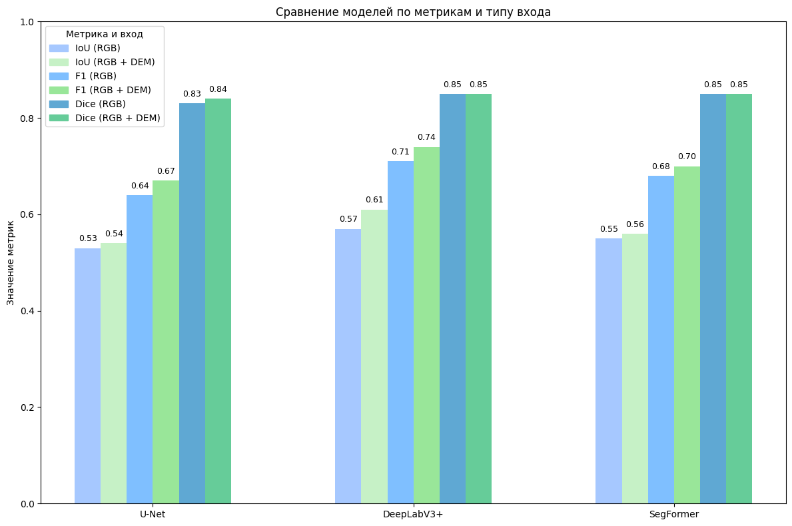

# Drainage-detection-topography
 
Этот проект посвящён семантической сегментации изображений для мониторинга состояния мелиоративных осушительных систем на основе данных дистанционного зондирования. Для анализа применяются современные модели глубокого обучения.

### Модели
Используемые модели
В рамках проекта реализованы и сравнены следующие архитектуры:

- U-Net

- SegFormer

- DeepLabV3+

Все модели обучаются на размеченных изображениях и сравниваются по различным метрикам качества сегментации. Также для моделей дополнительна реализована возможность адаптироваться под большее число входных каналов.

### Структура проекта
- `helper/` - содержит реализации классов для работы с датасетами и моделями 
- `engine/` - содержит вспомогательные функции для запуска обучения и тестирования, логирование
- `images_examples` - содержит примеры изображений, полученных в результате работы
- `notebooks/` - содержит вспомогательные Jupyter ноутбуки
- `main.py` - пример запуска для обучения и тестирования

### Запуск
Файл `main.py` позволяет быстро запустить обучение и тестирование одной из моделей:
```
python main.py
```
По умолчанию используется модель Segformer и датасет ver8. Вы можете изменить параметры внутри файла, указав название модели, название датасета и число каналов:

```
model_name = "Segformer"
dataset_name = 'ver8'
num_channels = 4
```

Опционально для логирования результатов Вы можете использовать MLFlow, запустив сервер в корне проекта:

```
mlflow ui
```
После запуска откройте интерфейс по адресу: `http://localhost:5000`.

Все вызовы `run_training` и `run_test` автоматически логируют метрики и параметры, если MLflow активен.

### Исследовательские задачи и результаты
Исследовательские задачи и результаты
Проект был выполнен в рамках научной работы и направлен на решение следующих задач:

- Формирование обучающего набора данных — собраны и размечены изображения для обучения моделей сегментации.

- Разработка и обучение нейросетевых моделей — реализованы и обучены архитектуры U-Net, SegFormer и DeepLabV3+.

- Сравнительный анализ моделей — проведена оценка точности моделей по метрикам качества 

- Оценка влияния цифровой модели рельефа (DEM) — экспериментально подтверждено, что добавление слоя рельефа положительно влияет на качество предсказаний.

